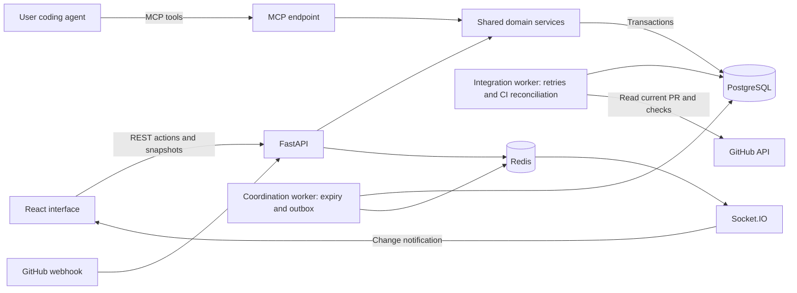

# Архитектура локальной alpha ComputeForGood

React показывает сохранённое сервером состояние. FastAPI, MCP и worker используют один доменный слой; PostgreSQL выполняет транзакции. Socket.IO обновляет интерфейс после сохранения, а Redis связывает процессы рассылки.

Контроль владения задачей выполняется блокировкой строки и ограничениями PostgreSQL. Наличие сообщения Socket.IO не определяет успех операции. При reconnect frontend перечитывает каталог, activity и submission через REST.

Каждый review относится к конкретному head SHA. Обновление PR сохраняет старые reviews для аудита, но исключает их из применимого quorum. Автор не может review свою submission. Содержание независимых reviews раскрывается сервером по правилам доступа, а не фильтром в React.

Демонстрационная конфигурация предназначена для loopback среды. Browser sessions, CSRF, scoped credentials и MCP OAuth реализованы; external-host проверки выполняются отдельно на публичном HTTPS-домене. Production Caddy направляет запросы через nginx на приватный backend; DB и Redis не имеют публичных портов. Веб-интерфейс не запускает чужие репозитории и модели на ComputeForGood сервере.
